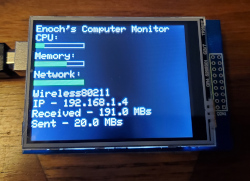
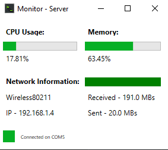
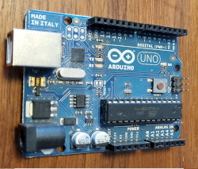

# Monitor Program
 

---
##### v1.0 Status:
  
  

## Purpose:
Creates a visual interface to output statistics about the computer to a screen driven by an Arduino Uno. Version 1.0 gathers CPU, Memory, and Network statistics. These transfer through USB Serial from the Windows Application to the Arduino as a display. Two programs drive this communication.

### Monitor Server -
Windows 10 based WPF built application to gather statistics of the computer. Detects when USB Serial connection is available and begins sending data.

### Monitor Client -
Displays a static screen until it receives data. Updates every second.

# Installation:

### Parts -
1. Windows 10 Computer
2. [Arduino Uno](https://store.arduino.cc/usa/arduino-uno-rev3) - $23
3. [Elegoo TFTLCD Screen](https://www.elegoo.com/products/elegoo-2-8-inches-tft-touch-screen) - $19

-- Build cost: $42

### Hardware Build -
The display is built to fit an Arduino uno. Pins are configured in code to these default settings.

- Arduino Uno:

- Elegoo TFTLCD Screen:

### Software Install
Use the Monitor Version 1.0 [Installer](https://github.com/zskelton/Monitor/releases/download/1.0/MonitorInstaller.msi).
- Run Monitor Server Exe
- Compile and Upload MonitorClient.ino with [Arduino IDE](https://www.arduino.cc/en/software).
- Plug in USB with Monitor Server Running to see statistics.

---
### TODOs
- [x] Create Working Version.
- [ ] Get rid of UI, make as a service.
- [ ] Remove Windows Dependence
- [ ] Make stylized UI for Arduino Client
- [ ] Create application to customize layout. 

#### Dependencies
- [Adafruit GFX Library](https://learn.adafruit.com/adafruit-gfx-graphics-library)
- [Adafruit TFTLCD Library](https://github.com/adafruit/TFTLCD-Library)
- [Visual Studio Code](https://visualstudio.microsoft.com/downloads/) (Or similar windows build environment for .Net Framework).
